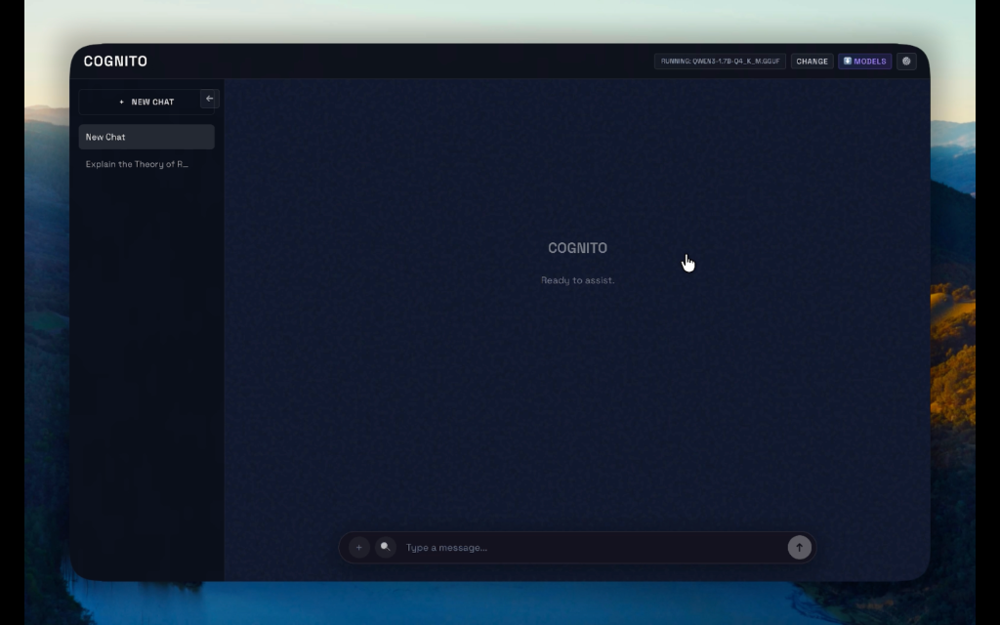

# COGNITO

**Private. Local. Fast.**

A fully local AI assistant that runs on your machine. No cloud, no data collection, no subscriptions. Your conversations stay yours.



---

## ✨ Features

### 🔒 100% Private
- All inference runs locally on your hardware
- No data ever leaves your machine
- No API keys or cloud accounts required

### 🚀 Fast & Lightweight
- Powered by llama.cpp for efficient inference
- Supports GGUF quantized models
- Works on Apple Silicon, NVIDIA GPUs, or CPU

### 🔍 Intelligent Search
- Built-in web search (model decides when to search)
- Deep search mode for comprehensive research
- Automatic context injection

### 📄 Document RAG
- Upload PDFs and text files
- Chat with your documents

### 🎨 Modern Interface
- Clean, dark-themed UI
- Chat history with session management
- System prompt customization

### ⬇️ In-App Model Downloads
- Browse models directly from Hugging Face
- One-click download of any GGUF model
- Automatic model management
- No external tools needed

---

## 🛠️ Installation

### Prerequisites

#### 1. Node.js (v18+)
- **Check if installed:**
  ```bash
  node --version
  ```
- **Install:**
  - [Download Node.js](https://nodejs.org/) (LTS recommended)
  - Or use a version manager like `nvm` (Mac/Linux) or `nvm-windows`.

#### 2. Python (v3.10+)
- **Check if installed:**
  ```bash
  python --version  # or python3 --version
  ```
- **Install:**
  - [Download Python](https://www.python.org/downloads/)
  - **Windows Users:** Make sure to check "Add Python to PATH" during installation.

#### 3. GPU Acceleration (Optional but Recommended)
- **macOS:** Apple Silicon (M1/M2/M3) works out of the box.
- **Windows/Linux:** NVIDIA GPU with CUDA drivers installed.

### Quick Start

1. **Clone the repository**
   ```bash
   git clone https://github.com/ArjunDeshwal/cognitoai.git
   cd cognitoai
   ```

2. **Set up Python backend**
   
   *macOS/Linux:*
   ```bash
   python3 -m venv venv
   source venv/bin/activate
   pip install -r backend/requirements.txt
   ```
   
   *Windows:*
   ```cmd
   python -m venv venv
   venv\Scripts\activate
   pip install -r backend/requirements.txt
   ```

3. **Install frontend dependencies**
   ```bash
   cd app
   npm install
   ```

4. **Run the app**
   ```bash
   npm run electron:dev
   ```

5. **Download a model**
   - Click "⬇️ Models" in the header
   - Browse and download a GGUF model
   - Select it to start chatting!

---

## 📁 Project Structure

```
cognito/
├── app/                    # Electron + React frontend
│   ├── src/
│   │   ├── App.tsx         # Main React component
│   │   ├── App.css         # Styles
│   │   ├── services/api.ts # API client
│   │   └── components/     # UI components
│   ├── electron/
│   │   ├── main.cjs        # Electron main process
│   │   └── preload.cjs     # Preload script
│   └── package.json
├── backend/
│   ├── server.py           # FastAPI server
│   ├── document_rag.py     # Document processing
│   └── requirements.txt
├── tools/
│   └── info/web_search.py  # Web search tool
└── README.md
```

---

## 🤝 Contributing

Open source on [GitHub](https://github.com/ArjunDeshwal/cognitoai) ·

### Development Setup

1. Fork the repository
2. Create a feature branch
   ```bash
   git checkout -b feature/amazing-feature
   ```
3. Make your changes
4. Test thoroughly
5. Commit with clear messages
   ```bash
   git commit -m "feat: add amazing feature"
   ```
6. Push and create a Pull Request

### Contribution Ideas

- **🐛 Bug Fixes** - Found a bug? We'd love a fix!
- **✨ New Features** - Check issues for feature requests
- **📖 Documentation** - Improve docs, add examples
- **🎨 UI/UX** - Enhance the interface
- **⚡ Performance** - Optimize inference, reduce memory
- **🧪 Tests** - Add test coverage

### Code Style

- **Frontend**: TypeScript, React hooks, CSS modules
- **Backend**: Python 3.10+, FastAPI, type hints
- **Commits**: Use [Conventional Commits](https://www.conventionalcommits.org/)

### Reporting Issues

When reporting bugs, please include:
- OS and version
- Node.js and Python versions
- Steps to reproduce
- Error messages/logs

---

## 📜 License

MIT License - see [LICENSE](https://github.com/ArjunDeshwal/cognitoai/blob/main/LICENSE) for details.

---

## 🙏 Acknowledgments

- [llama.cpp](https://github.com/ggerganov/llama.cpp) - Fast LLM inference
- [Hugging Face](https://huggingface.co) - Model hosting

---

<p align="center">
  <b>Built with ❤️ for privacy</b>
</p>
